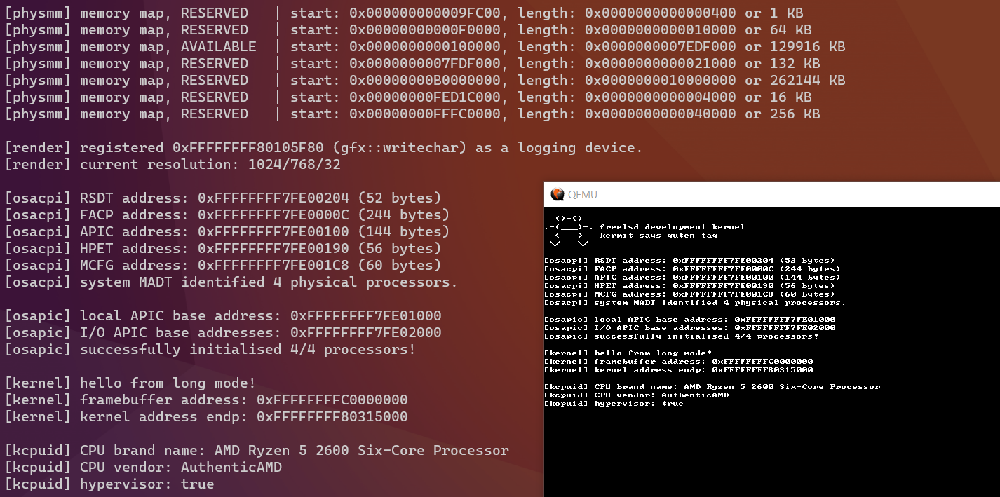

# freelsd
* A personal software project designed to run on x86_64 systems.
* This is just for fun, so don't expect anything usable for a while.
* See [Lemon](https://github.com/fido2020/lemon-os) for reasons I shouldn't be doing this.

## Features
FreeLSD currently has the following features implemented in the 64-bit branch:
* Support for Multiboot2, SSP and VESA graphics.
* Virtual and physical memory management.
* APIC-driven or PIC-driven interrupts.
* Support for SMP using ACPI <1.0.
* And of course, the FreeLSD frog!

## Minimum Requirements
Tested on QEMU, VMWare, Bochs and on bare-metal using my laptop. VirtualBox doesn't support huge pages when booting x86_64 systems unfortunately.
| x86_64                             |
| ---------------------------------- |
| 8MB of physical memory.            |
| Single-core x86_64 processor.      |
| Multiboot2 bootloader.             |
| Support for huge pages (PDPE1GB).  |
| Support for ACPI.                  |

## Compilation
FreeLSD uses Clang/LLVM (and NASM on x86_64) for compiling and assembling.

Simply install the prerequisites via your favourite package manager.
```
$ sudo pacman -S llvm lld clang nasm (on Arch Linux)
```

Once the compiler and assembler are installed, invoke `make disk` to create an empty disk image with the correct partition layout for FreeLSD. Then, invoke the Makefile using `make`. This will compile and link the kernel before copying it to the disk image. 

QEMU can be run immediately after by invoking `make qemu`.

Bochs can also be run immediately after using `make bochs`.

## Showcase (as of commit #176).

